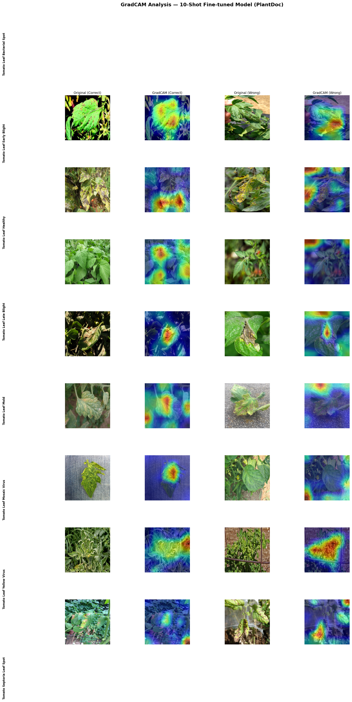
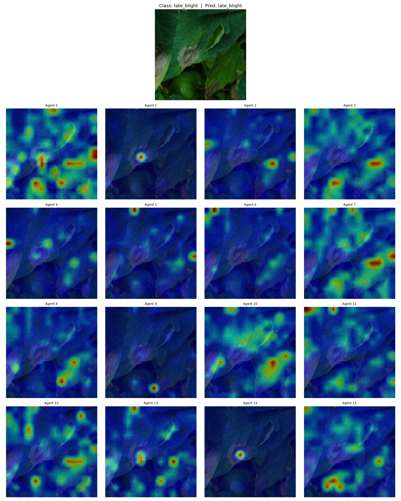
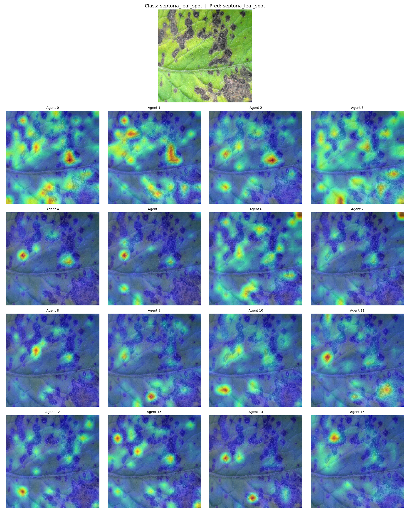

# Cross-Domain Plant Disease Classification

Bridging the gap between controlled lab images and real-world field photos for tomato leaf disease detection.

---

## The Problem

Models trained on clean, lab-photographed datasets (PlantVillage) achieve >99% accuracy in-distribution — but drop sharply when deployed on field photos (PlantDoc) with variable lighting, occlusion, background clutter, and mixed disease stages. This **domain gap** is the core challenge this project investigates.

**Setup:** 8 tomato disease classes, PlantVillage for pre-training, PlantDoc for fine-tuning (146 images) and evaluation (598 images).

---

## Approach

Two architectures were compared under identical, leakage-free experimental conditions (5-fold cross-validation for epoch selection; test set never opened during model development):

### EfficientNet-B0 Baseline
EfficientNet-B0 pre-trained on PlantVillage → frozen backbone → fine-tune classifier head on 146 PlantDoc images.

### KATv2 — Kernel Attention Transformer v2
A custom architecture adding a **prototype cross-attention module** on top of EfficientNet features:

```
EfficientNet-B0 (blocks.6 + conv_head trainable)
    → forward hook on blocks[4] → (B, 112, 14×14)
    → 1×1 conv projection → (B, 256, 14×14)
    → spatial flatten → (B, 196, 256)
    → 4-head cross-attention: 16 agent queries × 196 spatial tokens
    → agent outputs → (B, 16, 256)
    → out_proj + LayerNorm → Flatten → (B, 4096)
    → MLP: 4096 → 512 → 256 → NUM_CLASSES
```

16 learned "agents" each attend to different spatial regions, providing both interpretability (attention maps per agent) and, hypothetically, better domain adaptation through diverse spatial coverage.

---

## Results

All results below are **CV-clean**: epoch was selected by 5-fold stratified CV on the 146-image fine-tuning pool; the test set was opened exactly once per model.

### Final Model Comparison

| Model | Test Accuracy | Test Balanced Acc | Notes |
|---|---|---|---|
| EfficientNet Baseline (no FT) | 0.2943 | 0.2517 | PlantVillage weights only |
| EfficientNet 5-shot | 0.3763 | 0.3770 | 5 examples per class |
| EfficientNet 10-shot | 0.3880 | 0.3989 | 10 examples per class |
| KATv1 Full fine-tune | 0.2007 | 0.2031 | 8 agents, 7×7 feature map |
| KATv2 ep60 (leaky) | 0.4565 | 0.4510 | ⚠️ test set used for epoch selection |
| **KATv2 ep32 — CV-clean** | **0.3595** | **0.3545** | Methodologically valid |
| **EfficientNet ep20 — CV-clean** | **0.3729** | **0.3553** | Methodologically valid |

### Per-Class Breakdown (KATv2 ep60 checkpoint, 598 test images)

| Class | Support | Precision | Recall | F1 |
|---|---|---|---|---|
| bacterial_spot | 88 | 0.308 | 0.136 | **0.189** |
| early_blight | 71 | 0.389 | 0.521 | 0.446 |
| healthy | 51 | 0.368 | 0.490 | 0.420 |
| late_blight | 89 | 0.586 | 0.730 | **0.650** |
| mold | 73 | 0.500 | 0.219 | 0.305 |
| mosaic_virus | 44 | 0.255 | 0.318 | 0.283 |
| yellow_virus | 61 | 0.586 | 0.672 | 0.626 |
| septoria_leaf_spot | 121 | 0.492 | 0.521 | 0.506 |

---

## Key Findings

**1. Architecture is not the bottleneck.**
Under CV-clean conditions, KATv2 (balanced acc 0.3545) and EfficientNet (0.3553) perform nearly identically. The prototype cross-attention mechanism offers no measurable domain adaptation advantage — not because the idea is wrong, but because 146 fine-tuning images is too small a signal for it to learn from.

**2. Data leakage inflates results by ~0.10.**
The "ep60" result (0.4510) was obtained by visually inspecting test performance across epochs — a common but methodologically invalid practice. CV-clean evaluation reveals the true generalization estimate is ~0.354.

**3. The ~0.35 balanced accuracy ceiling.**
Focal loss (γ=2), AdaBN, diversity loss, and architectural changes all failed to push past this ceiling consistently. The limiting factor is the 146-image fine-tuning pool, not the loss function or model capacity.

**4. AdaBN is harmful when the backbone is partially trainable.**
With `blocks.6 + conv_head` unfrozen, BatchNorm statistics already adapt to the target domain during training. Re-updating them at inference breaks this adaptation (ep32: −0.015; ep60: −0.035).

**5. Failure modes are interpretable.**
Two distinct error types emerged from attention map analysis:
- *Visual similarity confusion:* `bacterial_spot` → `septoria_leaf_spot` (both produce small dark lesions)
- *Disease stage overlap:* `early_blight` (late stage) → `yellow_virus` (both show yellowing tissue)

---

## Visualizations

### GradCAM — 10-Shot Fine-tuned Model

Each row is one disease class. Columns show two test images and their GradCAM activation maps, indicating which regions drive the model's prediction.



### KATv2 Agent Attention Maps

Each of the 16 agents attends to a different spatial region. Below are two correctly predicted examples.

**late_blight ✓** — agents focus on the characteristic water-soaked lesion patches along leaf edges:



**septoria_leaf_spot ✓** — agents spread across the leaf surface, closely tracking the small dark lesion spots:



---

## Project Structure

```
plant_disease_project/
├── src/
│   ├── config.py               # All hyperparameters and constants
│   ├── dataset.py              # Data loading, augmentation, few-shot sampling
│   ├── model.py                # EfficientNet-B0, freeze/unfreeze helpers
│   ├── model_kat_v2.py         # KATv2: 16-agent, 4-head cross-attention
│   ├── fewshot_kat_v2.py       # Fine-tuning, CV, AdaBN pipelines
│   ├── fewshot_finetune.py     # EfficientNet PlantDoc fine-tuning
│   └── evaluate.py             # Evaluation utilities
├── scripts/
│   ├── run_cv_v2.py            # KATv2 5-fold CV → best epoch
│   ├── run_cv_efficientnet.py  # EfficientNet 5-fold CV + full retrain
│   ├── run_finetune_full_v2.py # KATv2 full retrain on best epoch
│   ├── run_adabn_v2.py         # AdaBN evaluation
│   └── visualize_kat_attention.py  # Per-agent attention map export
├── data/
│   └── processed/
│       ├── tomato_plantvillage/
│       └── tomato_plantdoc/
└── docs/
    └── figures/                # Selected visualizations (tracked in git)
```

> `models/`, `results/`, `data/raw/` are excluded from the repository (.gitignore).

---

## Setup

```bash
# Clone
git clone https://github.com/sedanurkilic/Cross-Domain-Plant-Disease-Classification.git
cd Cross-Domain-Plant-Disease-Classification

# Install dependencies
pip install torch timm albumentations scikit-learn matplotlib seaborn Pillow numpy
```

Data directories expected at `data/processed/tomato_plantvillage/` and `data/processed/tomato_plantdoc/`, each containing one subdirectory per class.

---

## Usage

```bash
# KATv2: select best epoch via 5-fold CV
python scripts/run_cv_v2.py

# KATv2: retrain on full fine-tuning pool for best epoch
python scripts/run_finetune_full_v2.py

# EfficientNet: 5-fold CV + full retrain
python scripts/run_cv_efficientnet.py

# Visualize KATv2 agent attention maps
python scripts/visualize_kat_attention.py

# Smoke test (fast, 2 folds × 2 epochs)
python scripts/run_cv_efficientnet.py --smoke
```

All scripts are run from the project root. Device is auto-detected (MPS on Apple Silicon, CPU fallback).

---

## What's Next

The central bottleneck is data, not architecture. The next meaningful step is expanding the 146-image fine-tuning pool — either by sourcing additional field images (FieldPlant, iNaturalist) or by adjusting the train/test split ratio. Architectural improvements have limited returns until this is addressed.

---

## Dependencies

```
torch  timm  albumentations  scikit-learn  matplotlib  seaborn  Pillow  numpy
```
